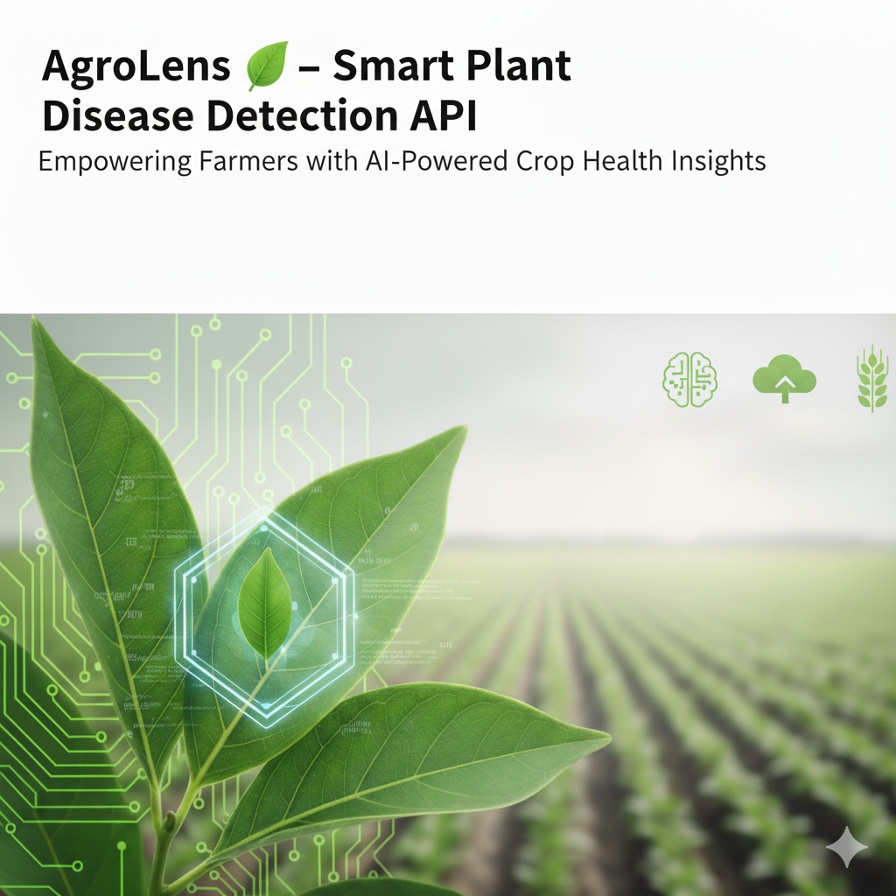
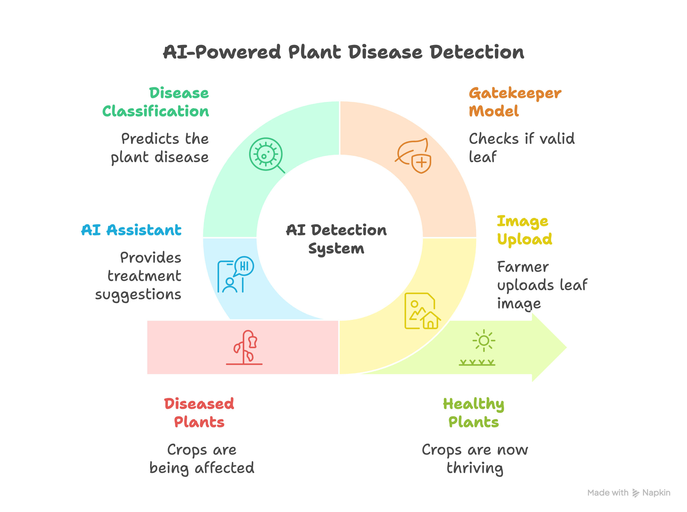

# 🌿 AgroLens – AI-Powered Plant Disease Detection System


*“Empowering Farmers with AI-Powered Crop Health Insights”*

---

## 👨‍🌾 About the Project

**AgroLens** is a smart, AI-powered web application that helps farmers instantly detect crop diseases from plant leaf images.
It combines **deep learning (TensorFlow Lite)** for disease detection and **AI chat assistance (Gemini API)** for multilingual treatment guidance — making advanced agricultural insights accessible to everyone.

Developed with love by **Team Bahubali** 💪

---

## 👥 Team Bahubali

| Name                      | Role                           |
| ------------------------- | ------------------------------ |
| **Anand Velpuri**         | Model Training & AI Integration|
| **Tejaswini Koribilli**   | Backend and Model Integration  |
| **Naga Mohan Madicharla** | Frontend Development           |
| **Sravanthi Kommasani**   | Frontend API Integration       |
|**Venkata LeeladharAbburi**| UI UX Designer                 |

---

## 🚀 Key Features

* 🪴 **AI-Based Disease Detection** – Upload a leaf image and get instant results
* 🧠 **Gatekeeper Model** – Ensures valid plant leaf images only
* 💬 **Gemini-Powered Chat Assistant** – Provides multilingual treatment advice
* 🌍 **Multilingual Support** – Responds in the user’s preferred language
* ⚙️ **Dual Architecture** – React Frontend + FastAPI Backend
* ⚡ **Optimized Models** – Uses lightweight TensorFlow Lite for fast inference

---

## 🧩 System Architecture

**Workflow Overview:**

1. User uploads a plant leaf image from the web app.
2. The **Gatekeeper Model** verifies if it’s a valid plant leaf.
3. The **Disease Detection Model** identifies the disease and confidence score.
4. The **Gemini API** generates detailed treatment info, precautions, and causes.
5. The **Frontend React App** displays results and enables interactive chat.

---

## 🖼️ Flow Diagram



---

## 🧠 Tech Stack

### 🔹 **Frontend (React)**

* React.js with Vite
* Tailwind CSS for modern responsive UI
* Axios for API integration
* Framer Motion for animations
* Deployed on **Hugging Face Spaces**

### 🔹 **Backend (FastAPI)**

* FastAPI for RESTful API development
* TensorFlow Lite for plant disease detection models
* Pillow & NumPy for image preprocessing
* Gemini API for intelligent multilingual responses
* Deployed on **Hugging Face Spaces** backend

---

## ⚙️ Installation & Setup

### 1️⃣ Clone the Repository

```bash
git clone https://github.com/TeamBahubali/AgroLens.git
cd AgroLens
```

---

### 2️⃣ Backend Setup (FastAPI)

```bash
cd backend
pip install -r requirements.txt
```

Create a `.env` file inside the backend directory:

```
GOOGLE_API_KEY=your_gemini_api_key
```

Run the server:

```bash
uvicorn main:app --reload
```

Backend runs at:
👉 `http://127.0.0.1:8000`

---

### 3️⃣ Frontend Setup (React)

```bash
cd frontend
npm install
npm run dev
```

Frontend runs at:
👉 `http://localhost:5173`

---

## 📡 API Endpoints

| Endpoint          | Method | Description                                  |
| ----------------- | ------ | -------------------------------------------- |
| `/`               | GET    | Welcome message                              |
| `/detect_disease` | POST   | Upload leaf image and get disease prediction |
| `/chat`           | POST   | Chat with AgroLens assistant                 |

---

## 🧾 Example API Response

```json
{
  "disease_info": {
    "predicted_disease": "Late Blight",
    "confidence_score": 92.4
  },
  "treatment_details": {
    "medicines": [
      {"name": "Fungicide X", "typical_dosage_or_application": "2g/L", "notes": "Apply weekly"}
    ],
    "precautions": ["Avoid waterlogging", "Use resistant varieties"],
    "causes": ["Fungal infection", "High humidity"],
    "summary": "Late Blight is a common fungal disease in tomatoes and potatoes.",
    "disclaimer": "Consult an agronomist for proper diagnosis and treatment."
  }
}
```

---

## 🌍 Impacts

* ✅ Early and accurate crop disease detection
* 💬 Multilingual support for better rural accessibility
* 🚜 Reduced dependency on agricultural experts
* 🌾 Improved crop yield and productivity

---

## 🌱 Benefits

* Real-time insights with AI precision
* Works on low-end devices using TFLite
* Scalable cloud-based deployment
* Promotes sustainable farming practices

---

## 🏁 Future Enhancements

* Real-time field monitoring using drone imagery
* Offline mobile app version for rural areas
* Integration with government agri databases

---

## 📜 License

This project is released under the **MIT License**.

---

## 💬 Acknowledgements

Special thanks to **Hugging Face**, **Google Gemini**, and **TensorFlow Lite** for enabling accessible AI innovation in agriculture.

---

### 🌟 *Developed by Team Bahubali – Innovating for Smarter Farming* 🌟
